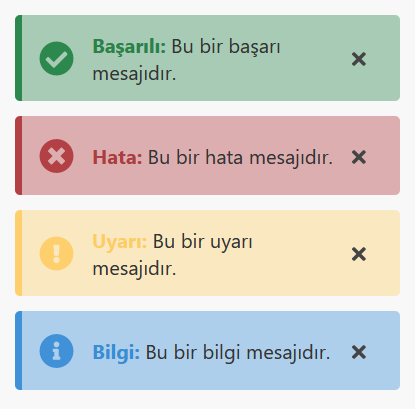

# Fast Alert
Hafif ve kullanışlı bildirim kutuları ile projeleriniz artık daha interaktif olacak.

## Fast Alert Kullanımı
Animasyon ve göresllik için projemize css dahil ediyoruz: `<link rel="stylesheet" href="fastalert.min.css"/>`

Kullanışlılık ve dinamiklik açısından javascript ekliyoruz: ``

>Javascript dosyasını `<head></head>` tagları arasına eklemeniz önerilir (Fast Alert döküman yüklendiğinde çalışır).

## `FastAlert` Class'ı kullanımı

FastAlert class'ı uyarı vermeye yarar, 5 parametre alır;

1. `title` Uyarı kutusunun başlığıdır, uyarı varildiğinde kalın bir şekilde belirtilir.
2. `desc` Mesajın içeriği, başlıktan sonra bu ksım yazdırılır.
3. `type` İkonlar ve renkler bu özelliğe göre belirlenir. Alabileceği değerler: (`success`, `danger`, `warning`, `info`).
4. `closeBtn` Gösterilen kutunun kullanıcı tarfından kapatılıp kapatılamayacağını belirler, iki değer alabilir: (`true`, `false`).
5. `time` Açılan kutunun kaç milisaniye açık kalacağı bu parametrede belirtilir.

## Örnek
`
new FastAlert({
	title: 'Başarılı',
	desc: 'Bu bir başarı mesajıdır.',
	type: 'success',
	closeBtn: true,
	time: '3500'
});`
